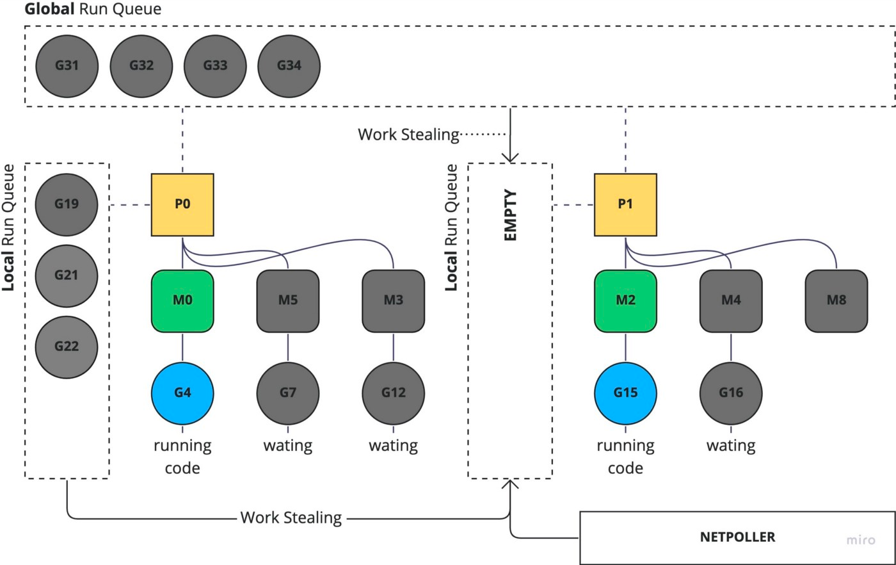

**What is the Channel?**

Channels are a mechanism that allow goroutines (which are similar to threads) to pass data from one to another. 
That makes it easier to write thread-safe concurrent programs and prevent race conditions.

Channels are ways to communicate between Goroutines by sending data through one end and receiving it at the other like a pipe. 
In their default state, an emitter Goroutine will block its execution until a receiver Goroutine takes the data. 
The same goes for a receiver Goroutine, which will block until some emitter sends data through the channel.

It provides go keyword to create goroutines. When go keyword is placed before a function call, it becomes goroutines.
Goroutines behave like threads but technically; it is an abstraction over threads.

A channel can be closed so that no more data can be sent through it.
It means closing a channel prevents a goroutine from sending data into it. But it does not prevent consuming data from the channel.
This makes sense as we would not want to risk crucial data being left orphaned.

Channels' two features are the following. 
The first one, channels can be sent as parameters to different goroutines. 
The second one, channels work as both a publisher and subscriber model. 
There is a one-to-one relationship between the sender and the receiver of the data. 
If there’s no receiver, a message is stuck with the sender.

In Go, the only practical way to use a channel is to communicate from one goroutine to another goroutine. 
Not only does the channel allow you to send values from one goroutine to another, 
but they also ensure the sending goroutine has sent the value before the receiving goroutine attempts to use it. 
Channels do this by blocking — by pausing all further operations in the current goroutine. 
A send operation blocks the sending goroutine until a goroutine executes a received operation on the same channel.

**Receive data from an empty channel and send data to a full channel**
In Go, receiving data from an empty channel operates similarly to sending data to a full channel, but with a slight twist. 
Whenever a goroutine attempts to pull data from an empty channel, it will block until the channel has data. 
The goroutine is added to a queue in the channel struct for receivers. 
But when another goroutine attempts to send data to a channel with waiting receivers, that data does not get added to the buffer. 
Instead, the runtime passes the data directly to the first waiting goroutine, bypassing the buffer entirely.

**Select**
The select statement is used to handle more than one channel input within a Goroutine.
In the select structure, we ask the program to choose between one or more channels to receive their data.
The select structure is just executed once; it doesn't matter if it is listening to more channels, it will be executed only once and the code will continue executing. If we want it to handle the same channels more than once, we have to put it in a for loop.

**Goroutines**

Since Go 1.4, the minimal size of a goroutine object is 2 KB, it can be extended to 1 GB. 
It is advised in most cases, run all your goroutines on one core but if you need to divide goroutines among available CPU cores of your os, 
you use the GOMAXPROCS environment variable or call to runtime using function runtime.GOMAXPROCS(n) where n is the number of cores to use.

But you may sometime feel that setting GOMAXPROCS > 1 is making your program slower.

In Golang, it has an M: N scheduler that can also utilize multiple processors. 
At any time, M goroutines need to be scheduled on N OS threads that run on most "GOMAXPROCS" numbers of processors.
At most only one thread is allowed to run per core.

If your program does not start any additional goroutines, 
it will naturally run in only one thread no matter how many cores you allow it to use.
Goroutines require less memory than threads, less time to start up and stop.
main() is a special goroutine.

The runtime scheduler multiplexes the goroutines to a few OS threads.
There are 3 types of goroutines, running, runnable and blocked. 
1.running which are the ones that are actually being running in an OS thread; 
2.runnable which are the ones that are ready to be executed, but they are paused; 
3.blocked which are the goroutines that are not ready for execution. 

Go manages goroutines at two levels, local queues and global queues. 
Local queues are attached to each processor, while the global queue is common. 
Goroutines do not go in the global queue only when the local queue is full, 
and they are also pushed in it when Go injects a list of goroutines into the scheduler.

**how block Goroutines and channels** 
time.Sleep can be used to block a goroutine. Channel operations are also blocking in nature. 
When some data is written to the channel, goroutine is blocked until some other goroutine reads it from that channel. 
At the same time, channel operations tell the scheduler to schedule another goroutine, 
that’s why a program does not block forever on the same goroutine. 
These features of a channel are very useful in goroutines communication as it prevents us from writing manual locks and hacks to make them work with each other.

**Some differences between thread and goroutine.**

1. OS threads are managed by kernel and has hardware dependencies. 
Goroutines are managed by go runtime and has no hardware dependencies.

2. OS threads generally have fixed stack size of 1-2MB. 
Goroutines typically have 2KB (since Go 1.4) of stack size in newer versions of go.

3. Stack size is determined during compile time and can not grow. 
Stack size of go is managed in run-time and can grow up to 1GB which is possible by allocating and freeing heap storage

4. There is no easy communication medium between threads. There is huge latency between inter-thread communication. 
Goroutine use channels to communicate with other goroutines with low latency.

5. Threads have identity. There is Thread ID which identifies each thread in a process. 
Goroutine do not have any identity. Go implemented this because go does not have TLS(Thread Local Storage).

6. Threads have significant setup and teardown costs as a thread has to request lots of resources from OS and return once it's done. Goroutines are created and destroyed by the go's runtime. These operations are very cheap compared to the thread as go runtime already maintains a pool of threads for goroutines. In this case, OS is not aware of goroutines.

7. Threads are preemptively scheduled. Switching cost between threads is high as scheduler needs to save/restore more than 50 registers and states. This can be quite significant when there is rapid switching between threads.	
Goroutines are cooperatively scheduled. When a goroutine switch occurs, only 3 registers need to be saved or restored.

When a processor does not have any Goroutines, it applies the following rules in this order:
1. pull work from the own local queue
2. pull work from network poller
3. steal work from the other processor's local queue
4. pull work from the global queue

Since a processor can pull work from the global queue when it runs out of tasks, the first available Processor will run the goroutine. 
This behavior explains why a goroutine runs on different Processors and shows how Go optimizes the system by letting other goroutines run when a resource is free.

**Why Golang is faster?**
When we run a Go program, Go runtime will create a few threads on a core on which all the goroutines are multiplexed. 
At any point in time, one thread will be executing one goroutine and if that goroutine is blocked,
then it will be swapped out for another goroutine that will execute on that thread instead. 
This is like thread scheduling but handled by Go runtime and this is much faster. 
Goroutines require less memory than threads and less time to start up and stop.

In other languages, the traditional way to pass data from one thread to another is through shared memory that is safeguarded by a lock. 
One thread writes data to memory and another thread reads or updates the data from that same spot in memory. 
But threads are unpredictable and could end up conflicting with one another, which is why a lock is needed. 
However, using a lock can be ripped off. 
It's the source of a litany of hard-to-detect bugs. 
Channels allow you to avoid those bugs by abstracting away that complexity into a simple-to-use interface.

In this diagram, you can see that P1 ran out of goroutines. So the Go's runtime scheduler will take goroutines from other processors. 
If every other processor run queue is empty, it checks for completed IO requests (sys calls, network requests) from the net-poller. 
If this net-poller is empty, the processor will try to get goroutines from the global run queue.

“Concurrency is about structure and parallelism is about execution. In other words, concurrency is a way to structure a thing so that you can (maybe) use parallelism to do a better job.” — Rob Pike

CPU-bound workloads(受CPU限制的工作负载)
It won’t show any performance improvement
if we run it in a single core with multiple goroutines as the go runtime will waste valuable time scheduling goroutines in and out,
also known as context switching.

I/O-bound workloads(受IO限制的工作负载)
We need to be careful not to spawn more goroutines than cores available to avoid losing performance.
